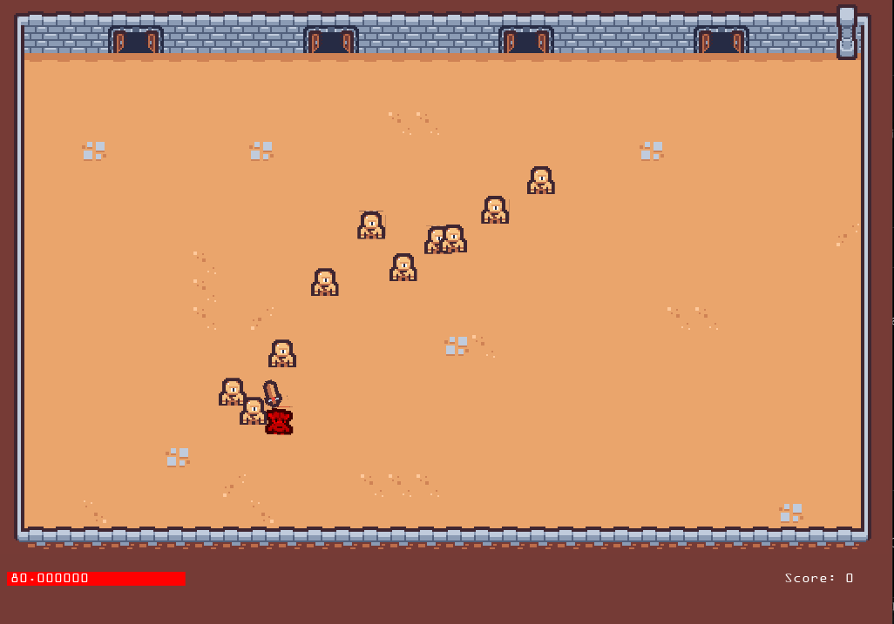

# ArenaGame
Small game made with C++ and OpenGL

Third party libs used:

- GLFW for window management (https://www.glfw.org/)
- GLM for maths (https://github.com/g-truc/glm)
- irrKlang for sound (https://www.ambiera.com/irrklang/)
- stb_image to load sprites (https://github.com/nothings/stb/blob/master/stb_image.h)
- TMXlite to parse tmx files (https://github.com/fallahn/tmxlite)

